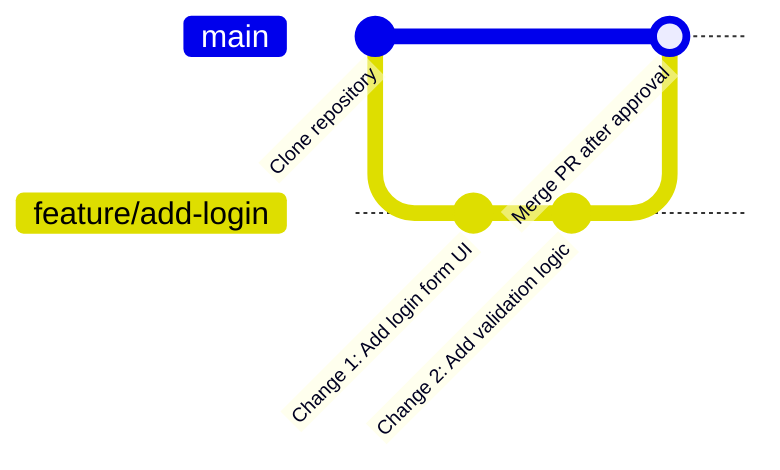

```mermaid
%%{init: {"gitGraph": {"theme": "base"}}}%%

gitGraph
   commit id: "Clone repository"
   branch feature/add-login
   checkout feature/add-login
   commit id: "Change 1: Add login form UI"
   commit id: "Change 2: Add validation logic"
   checkout main
   merge feature/add-login id: "Merge PR after approval"

```

